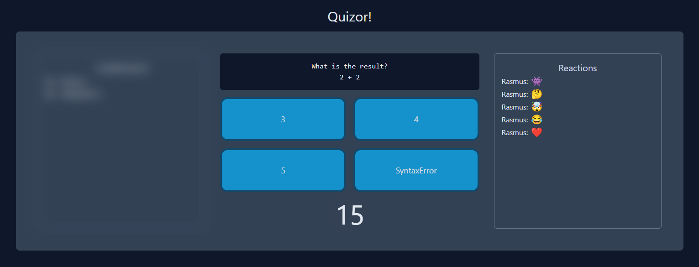
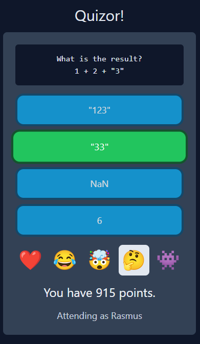

# Quizor

Quizor (formerly TemplaHoot) is a Kahoot! inspired quiz intended to run on a projector / video share while attendees participate using their own device.

The current set of questions involve JavaScript quirks and weirdness, inspired by quizzes at NDC Oslo 2022 and talks like the amazing WAT talk by Gery Bernhardt: https://www.destroyallsoftware.com/talks/wat

Questions can be changed in: https://github.com/rasmuskl/Quizor/blob/master/Quizor/Code/QuizInfo.cs

## Screenshots

Host view example:

Client / participant phone example:

## Background

Quizor was developed as an experiment at an internal company conference to see if it was doable provoked by the surprisingly high prices for popular online quiz services.

Development started 24 hours before a 50 partipant quiz was run without any issues. To minimize the risk of overloading it was run on a P3V3 Azure App Service instance (8 vCPU, 32 GB memory) but CPU utilization averaged about 1% during the quiz, so much less should suffice.

Given that the code was written in about 8 hours of development time for 2 people over a 24 hour period, the code is optimized for speed of development / demoability over any sort of quality and maintainance.

## Important technology and design choices

Given the fact that we only had 24 hours we made a few key technology and design choices for this to be possible.

### Blazor Server

Blazor Server provides a websocket connection for each client connection including a client-server React-like model providing the perfect model for an interactive application like this. Since all HTML is rendered on the server and can be triggered either from browser events transmitted over the websocket connection from the client or directly from the server side, it allows for rapid development without implementing layers or APIs. 

### .NET Channels / Hosted Service

We did not have the time or need to integrate an external persistance layer. But keeping state in memory with events coming in from many participants means we need a strategy for dealing with race conditions. We decided to create a .NET `Channel` (multi-producer / multi-consumer) with a single dedicated `IHostedService` consumer and represented all state changes as `Command` records passed through this channel. This gives us an like environment where all state changes are controlled from a single thread (blocking if Tasks go to other threads) and removes the need for locks. We did opt for .NET concurrent collections for state storage due to views also reading directly from these, even though it should not be needed.

### Tailwind CSS

We needed something that would allow the quiz to look great while allowing us to move rapidly. Simply adding the Tailwind Play CDN (https://tailwindcss.com/docs/installation/play-cdn) as a single script tag and letting it scan our HTML for Tailwind usage worked great for this.